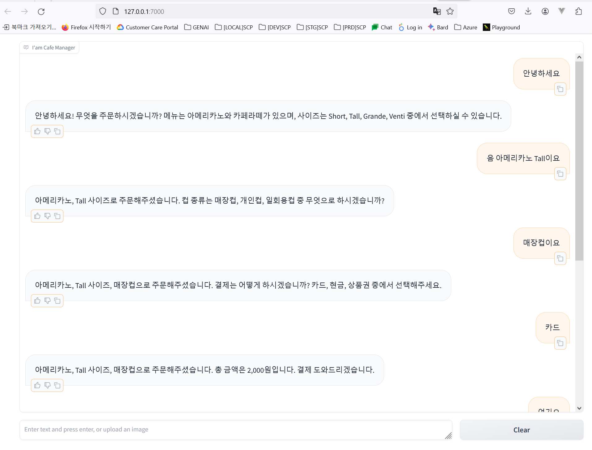

# Customized Cafe Order Chatbot

This is a chatbot that simulates a cafe order-taking process. The bot guides the user through ordering a drink, choosing a cup type, and payment method. It ensures that only available menu items are ordered and provides a structured response format.

# Screenshot


## Features
- Step-by-step ordering process.
- Validation of menu items.
- Interactive UI using Gradio.
- Real-time updates and responses.

## Setup

### Prerequisites
- Python 3.8 or higher.
- A virtual environment (optional but recommended).
- An OpenAI API key.

### Installation

1. Clone the repository:

```bash
git clone https://github.com/your-repo/customized-cafe-order-chatbot.git
cd customized-cafe-order-chatbot
```
2. Create and activate a virtual environment:

```bash

python -m venv .venv
source .venv/bin/activate  # On Windows, use `.venv\Scripts\activate`
```

3. Install the required packages:

```bash

pip install -r requirements.txt
```

4. Set up the environment variables:


Create a .env file in the project folder and add belows and change your OpenAI API key:
- https://platform.openai.com/api-keys

```makefile
OPENAI_API_KEY=YOUR OWN KEY
OPENAI_MODEL = 'gpt-4o' #'gpt-4-turbo-preview'  # gpt-4-0125-preview	gpt-4-1106-preview
PORT=7000
```

# Running the Chatbot

Run the following command to start the chatbot:

```bash

python app.py
```
The chatbot will be available at http://localhost:8080.

# Usage

1. Open the chatbot interface in your browser.
2. Follow the chatbot prompts to place an order.
3. The chatbot will guide you through selecting a drink, size, cup type, and payment method.
4. The bot will validate your selections and proceed to the next steps accordingly.

# File Structure

- app.py: The main application script.
- requirements.txt: The dependencies required for the project.
- .env: Environment variables for the OpenAI API key.

# Additional Notes

- Ensure your OpenAI API key is kept secure and not shared publicly.
- You can modify the chatbot's behavior and prompts by editing the 
- PROMPT_MAIN variable in app.py.

# License

This project is licensed under the MIT License.

